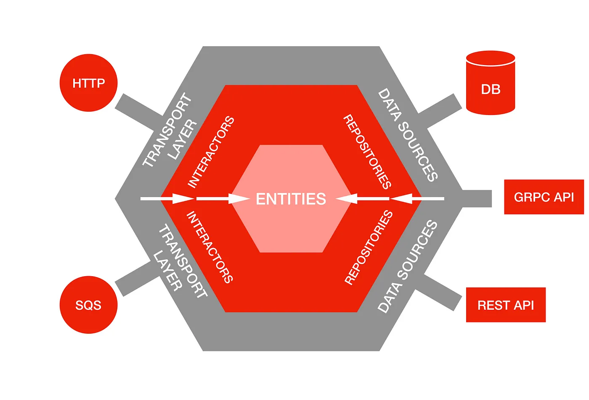

# Go-Lang Hexagonal Architecture

[](https://codecov.io/gh/damasdev/go-hexagonal-architecture)

This project demonstrates the implementation of Hexagonal Architecture (also known as Ports and Adapters) in Go. The architecture aims to create loosely coupled components that are easy to test and maintain.

## Core Concepts



Source: https://netflixtechblog.com/ready-for-changes-with-hexagonal-architecture-b315ec967749

## Project Structure

```
├── cmd
│   ├── server
│   │   └── main.go
├── internal
│   ├── core
│   │   ├── domain
│   │   ├── ports
│   │   ├── services
│   │   └── utils
│   ├── infrastructures
│   └── interfaces
└── pkg
```

The folder structure in the project is organized to follow the principles of Hexagonal Architecture, which promotes separation of concerns and modularity. Here's a breakdown of each folder:

### cmd

This directory typically contains the entry points for the application, such as the main executable files. Each subdirectory under `cmd` would represent a different command or service.

### internal

This directory is used for packages that are not intended to be used by external code. It contains the core business logic and other internal components.

#### internal/core

This subdirectory contains the core business logic of the application.

- **domain**: This folder holds the domain models and entities.
- **ports**: This folder contains the interfaces that define the boundaries between the core business logic and the outside world.
- **services**: This folder includes the implementation of the business logic services.
- **utils**: This folder contains utility functions and helpers that support the core business logic.

#### internal/infrastructures

This folder contains the infrastructure-related code, such as database connections, external APIs, and other external services.

#### internal/interfaces

This folder includes the adapters that implement the interfaces defined in the `ports` folder, facilitating communication between the core business logic and the outside world.

### pkg

This directory is used for packages that are intended to be used by external code. It can contain utility functions, libraries, or other reusable components.

## Getting Started

### Running the Application

To run the application, use the following command:
```sh
go run cmd/server/main.go
```

### Running Tests

To run tests, use the following command:
```sh
go test ./...
```